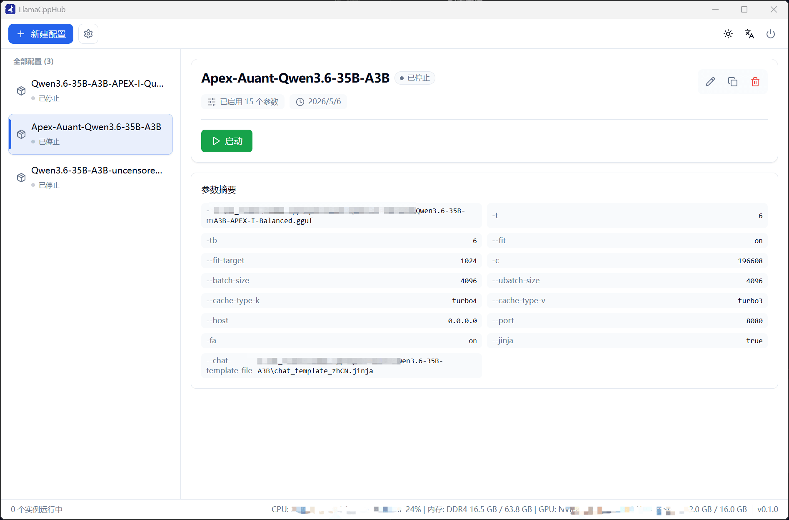
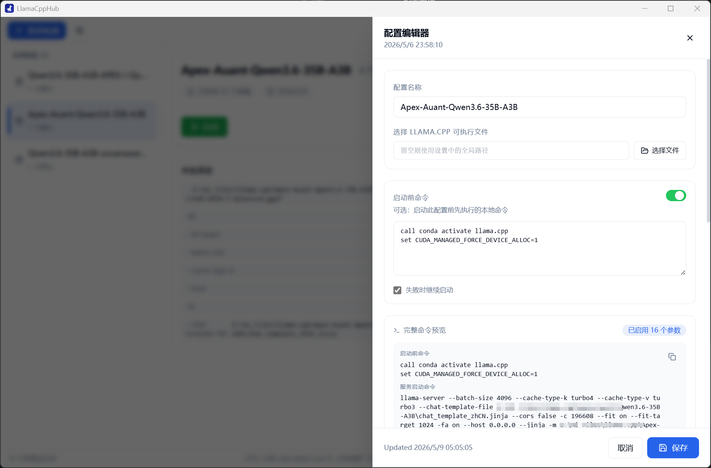
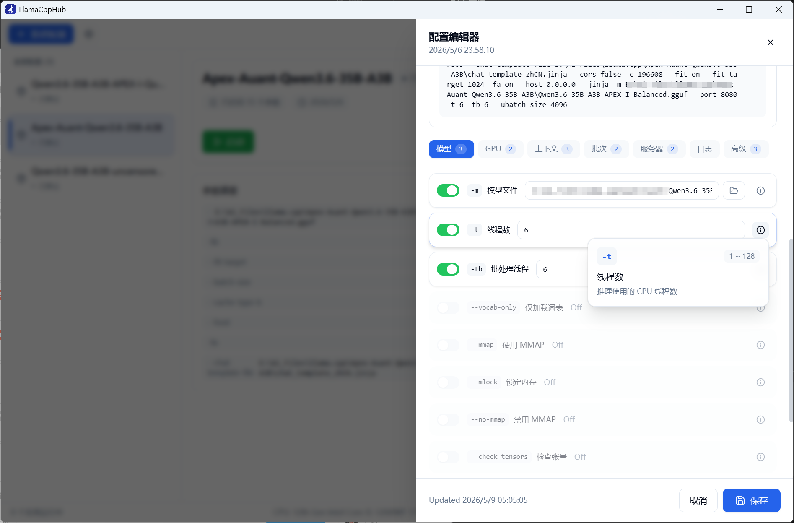
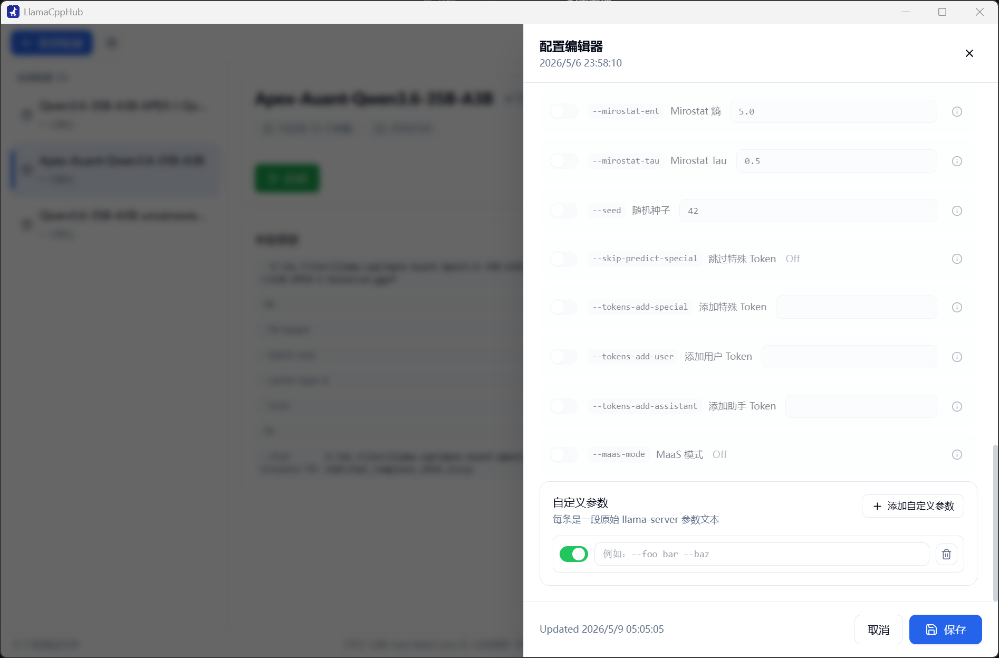
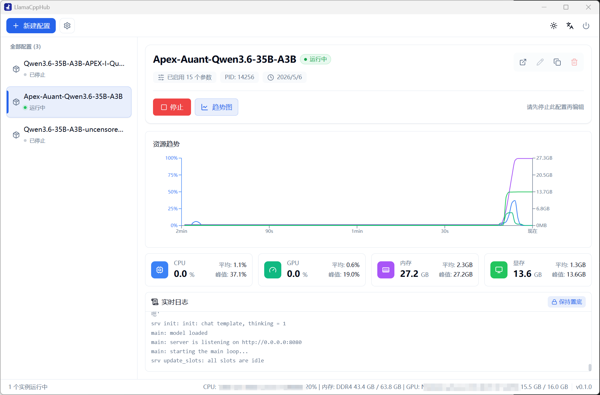

# LlamaCppHub

**中文** | [English](docs/README.en.md)

LlamaCppHub 是一个 `llama.cpp`用户界面外壳，可以非常方便地管理多个配置并运行`llama.cpp`本地推理。

## 功能特性

- **配置管理**
  - 支持多个不同配置
  - 便捷编辑和复制配置
- **llama.cpp 设置**
  - 支持设置全局 `llama.cpp`
  - 支持为配置单独指定 `llama.cpp`
- **启动参数**
  - 快速配置官方参数
  - 自定义原始参数以支持不同 `llama.cpp`分支功能
  - 支持启动前命令
  - 预览最终服务启动命令
- **实例运行**
  - 启动和停止本地  `llama.cpp` 
  - 查看实例 PID、运行状态和实时日志
  - 快速打开Web Chatbox
- **资源监控**
  - 显示配置运行时的 CPU、GPU、内存、显存占用等信息
  - 使用趋势图观察资源变化
- **桌面体验**
  - 系统托盘，后台运行
  - 中英文界面
  - 浅色、深色主题

## 截图

<table>
  <tr>
    <td width="50%">
      <strong>本地配置</strong><br>
      
    </td>
    <td width="50%">
      <strong>配置总览</strong><br>
      
    </td>
  </tr>
  <tr>
    <td width="50%">
      <strong>参数与参数说明</strong><br>
      
    </td>
    <td width="50%">
      <strong>自定义参数</strong><br>
      
    </td>
  </tr>
  <tr>
    <td width="50%">
      <strong>运行监控、资源趋势与实时日志</strong><br>
      
    </td>
    <td width="50%"></td>
  </tr>
</table>

## 技术栈

- **桌面框架**：Tauri 2
- **前端**：React 18、TypeScript、Vite
- **后端**：Rust
- **样式**：Tailwind CSS
- **状态管理**：Zustand
- **国际化**：i18next、react-i18next
- **图表**：Recharts
- **图标**：lucide-react

## 环境要求

开发或自行构建前，请先准备：

- Node.js 与 npm
- Rust 工具链
- Tauri 2 所需系统依赖
- 可用的 `llama.cpp server` 可执行文件

> Tauri 的系统依赖会因操作系统不同而不同，请根据你的开发平台安装对应依赖。

## 快速开始

安装依赖：

```bash
npm install
```

启动桌面开发模式：

```bash
npm run tauri:dev
```

如果只需要启动前端开发服务：

```bash
npm run dev
```

## 常用脚本

| 命令 | 说明 |
| --- | --- |
| `npm run dev` | 启动 Vite 前端开发服务 |
| `npm run build` | 执行 TypeScript 检查并构建前端资源 |
| `npm run tauri` | 调用 Tauri CLI |
| `npm run tauri:dev` | 以开发模式启动桌面应用 |
| `npm run tauri:build` | 构建正式桌面应用产物 |

## 正式构建

执行：

```bash
npm run tauri:build
```

构建产物由 Tauri 生成，输出目录和安装包格式取决于当前操作系统与 `src-tauri/tauri.conf.json` 中的打包配置。

## 基本使用流程

1. 打开 LlamaCppHub。
2. 在设置页配置全局 `llama.cpp server` 可执行文件路径。
3. 新建配置，填写配置名称、模型文件路径和需要的启动参数。
4. 如有需要，添加启动前命令或自定义参数。
5. 在命令预览中确认最终启动命令。
6. 启动配置对应的本地 server 实例。
7. 在详情页查看运行日志、资源占用和趋势图。
8. 使用停止按钮结束实例。

## 项目结构

```text
.
├── src/                  # React 前端源码
├── src-tauri/            # Tauri / Rust 后端源码与打包配置
├── public/               # 前端静态资源
├── package.json          # npm 脚本与前端依赖
├── vite.config.ts        # Vite 配置
├── tailwind.config.js    # Tailwind CSS 配置
└── tsconfig*.json        # TypeScript 配置
```

> 目录结构可能随项目演进调整，请以实际代码为准。

## 贡献

欢迎通过 Issue 或 Pull Request 改进项目。

建议在提交变更前：

- 保持变更范围清晰、聚焦
- 遵循现有代码风格
- 运行必要的构建或检查命令
- 避免混入与本次变更无关的格式化或重构

> 本软件大部份代码也是由本地部署的Qwen3.6-35B-A3B编写

## 许可证

[**GNU General Public License v3.0**](LICENSE)